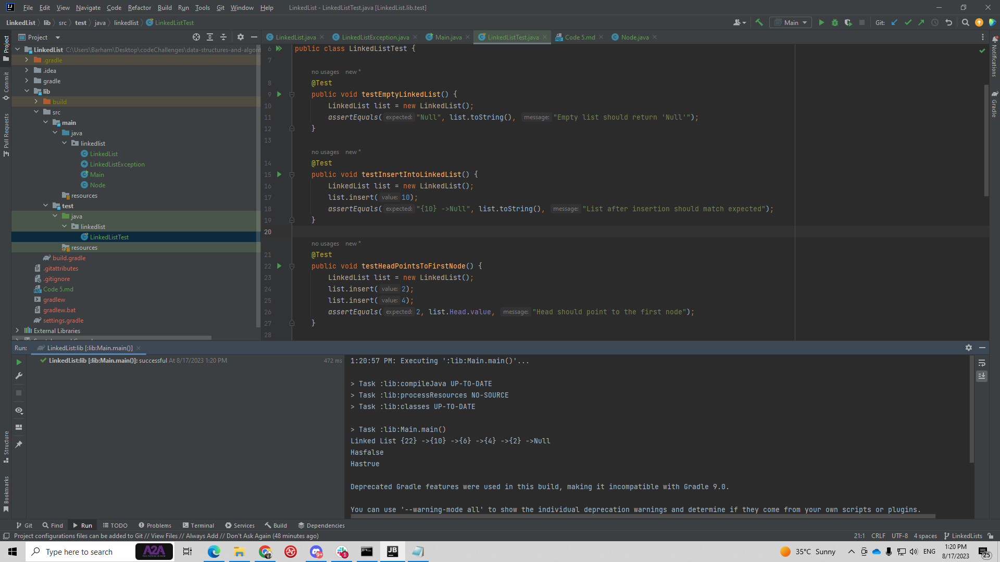

# Linked List
 creating a linked list using encapsulation from other class which is the node class to insert and delete from the list   

## Whiteboard Process

## Approach & Efficiency
this code sets up a linked list where items are added to the front and checks for a value are done by looking through the list from the start until the value is found or all nodes are checked.
Insertion:O(1)
Search:O(n)
space:O(n)

## Solution
 