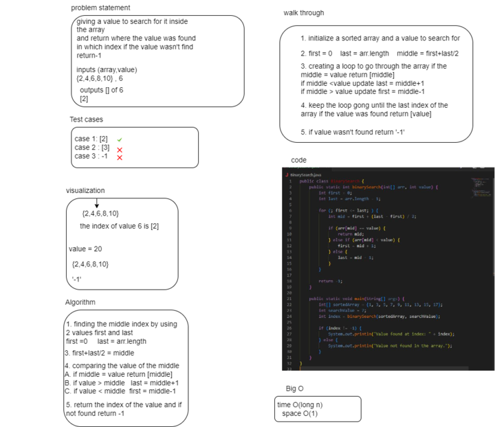

# data-structures-and-algorithms

# Challenge Title

***03*** **BinarySearch**
 The challange was about a whiteboard representing a method called **BinarySearch** this method works on searching for a value inside a sorted array and then return the index of the value and if not found return '-1'

## Whiteboard Process

## Approach & Efficiency

the approach was finding the middle index of an array and compare the middle index value with the value inserted in the parameter if it equals ti it return the index of middle if not check if it's bigger or smaller then the middle index if bigger make last = middle+1 , if smaller make first = middle-1 and continue searching whereever it's foun return the index where it is and if not found return '-1'.
 *time* O(log n)     *space* O(1)

 ## Solution 

 1. declaring a sorted array and a value  
 2. make first =0   and last = the last index of array     then find the middle = firts+last/2
 3. create loop to check if the value matches any values inside the array and return the index if not found return -1

