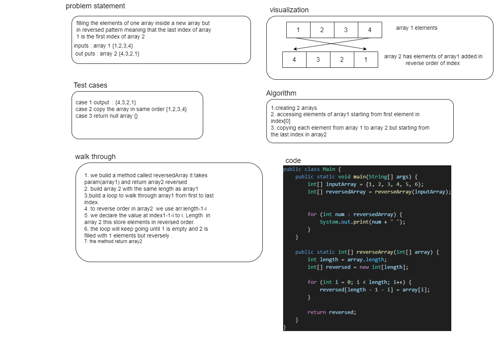

# challenge 01 

was about creating a whiteboard that shows the algorthim, visualization, test cases , code and wlak through for filling elements of an array inside another array but reversed.

## effiecency 
the algorthim will insert array element into new array reversed and the time complixety will be o(n) 
## solution 
is to create a method that access array 1 and goes through it copying the elements to array 2 starting from the last index of it.
