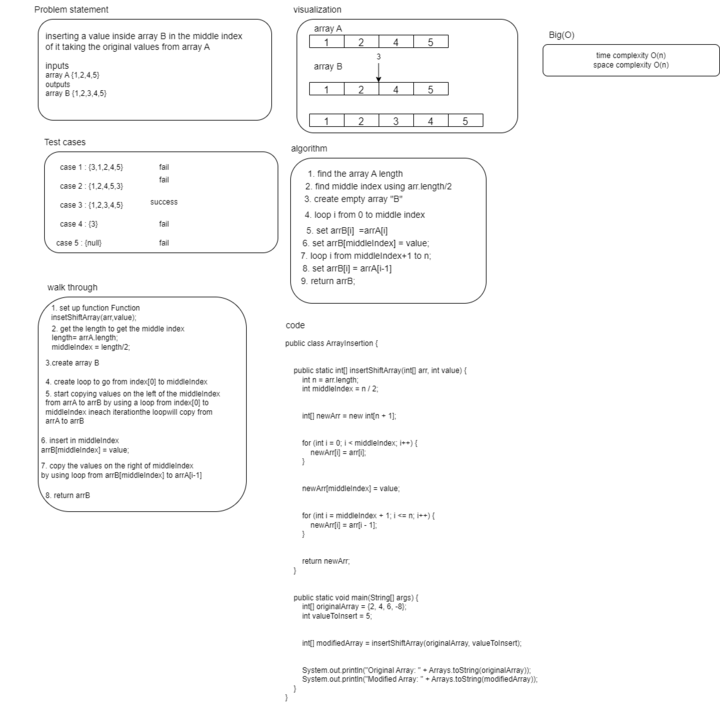

# data-structures-and-algorithms

# Challenge Title

***02*** **Inser-shift-array**
 The challange was about a whiteboard representing a method called **insertShiftArray** this method works on inserting a value in the middle index of the array and returns a new array.

## Whiteboard Process

## Approach & Efficiency

The approach was knowing the length of the original array to get the middle index then creating a loop that copies from the old array to the new array the first loop copies all values before the middle index then it gets to the middle index and inserts the value intoit after that another loop continues copying the values after the middle index until the end of the array.
 *time* O(n)     *space* O(n)

 ## Solution 

 1. creating 2 arrays and 2 loops 
 2. the first array is the old array
 2. the second array is the new array 
3. getting the middle index by  getting the length of the old array and divide it on 2 

5. creating loop to copy from the old array from the first index until the middle index.

6. inserting into the middle index

7. creating a loop to copy after the middle index to the last index.

8. returning the new array.

