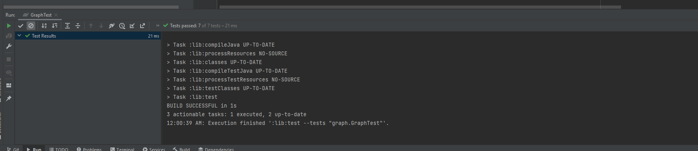

# Graph- Breadth-First
given a graph represented by nodes and edges. Each node in the graph has a unique value, and edges connect nodes to represent relationships between them. Your task is to implement the breadthFirst method, which takes a starting node as an argument and returns a collection of nodes in the order they were visited during the breadth-first traversal.
## Whiteboard Process

## Approach & Efficiency
Time Complexity: O(N + E)
Space Complexity: O(N)

Initialize Data Structures:

Create a queue to store nodes to be visited (Queue<Node>).
Create a set to keep track of visited nodes (Set<Node>).
Create a list to store the result of the traversal (List<Node>).
Enqueue the Start Node:

Enqueue the starting node into the queue.
Add the starting node to the visited set.
Breadth-First Traversal Loop:

While the queue is not empty:
Dequeue a node from the front of the queue.
Process the node (e.g., add it to the result list, display its value).
Enqueue all unvisited neighbors of the current node.
Add the current node to the visited set.

## Solution
