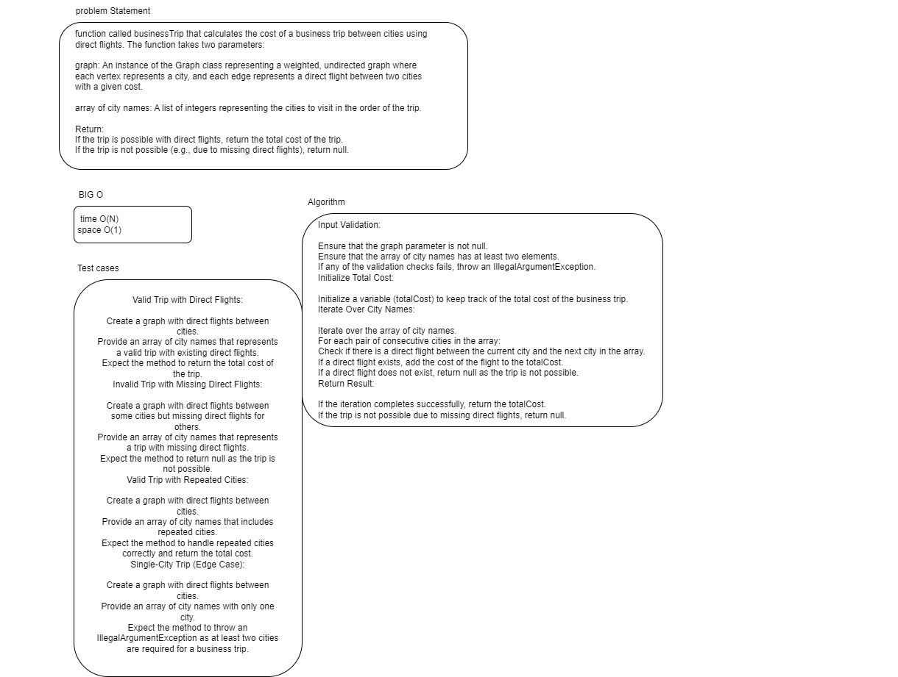
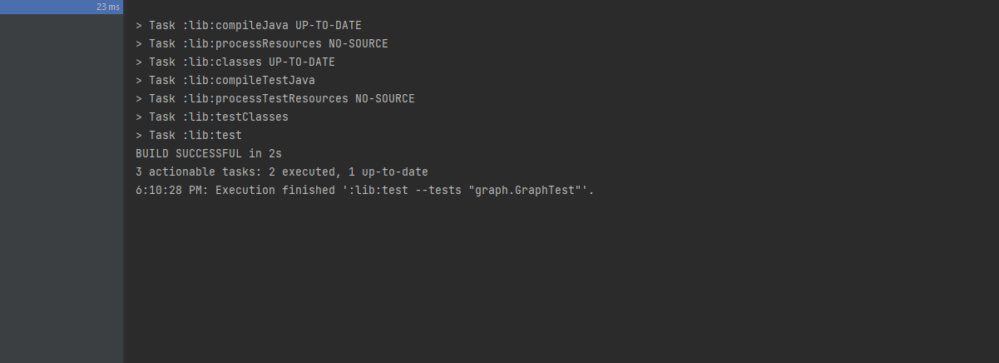

# graph-business- trip 

function called businessTrip that calculates the cost of a business trip between cities using direct flights. The function takes two parameters:

graph: An instance of the Graph class representing a weighted, undirected graph where each vertex represents a city, and each edge represents a direct flight between two cities with a given cost.

array of city names: A list of integers representing the cities to visit in the order of the trip.

Return:
If the trip is possible with direct flights, return the total cost of the trip.
If the trip is not possible (e.g., due to missing direct flights), return null.
## Whiteboard Process

## Approach & Efficiency
Input Validation:

Ensure that the graph parameter is not null.
Ensure that the array of city names has at least two elements.
If any of the validation checks fails, throw an IllegalArgumentException.
Initialize Total Cost:

Initialize a variable (totalCost) to keep track of the total cost of the business trip.
Iterate Over City Names:

Iterate over the array of city names.
For each pair of consecutive cities in the array:
Check if there is a direct flight between the current city and the next city in the array.
If a direct flight exists, add the cost of the flight to the totalCost.
If a direct flight does not exist, return null as the trip is not possible.
Return Result:

If the iteration completes successfully, return the totalCost.
If the trip is not possible due to missing direct flights, return null.

time O(n)    Space O(1)
## Solution
 