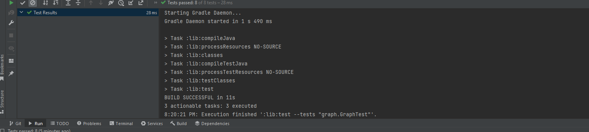

# Graph- depth- first 
Implement a method to perform a breadth-first search (BFS) starting from the given vertex. BFS is an algorithm used for traversing or searching tree or graph data structures.

The method should return a collection of vertices representing the order in which they are visited during the breadth-first search.
## Whiteboard Process

## Approach & Efficiency
Initialize Data Structures:

Create an empty queue (Queue<Integer>) to store vertices for BFS traversal.
Create a set (Set<Integer>) to keep track of visited vertices.
Enqueue and Mark the Starting Vertex:

Enqueue the starting vertex into the queue.
Mark the starting vertex as visited in the set.
BFS Traversal Loop:

While the queue is not empty:
Dequeue a vertex from the queue.
Add the dequeued vertex to the result collection.
For each unvisited neighbor of the dequeued vertex:
Enqueue the neighbor.
Mark the neighbor as visited.
Return Result Collection:

Once the queue is empty, return the result collection of vertices in the order of BFS traversal.

time O(V+E )    space O(V)

## Solution
