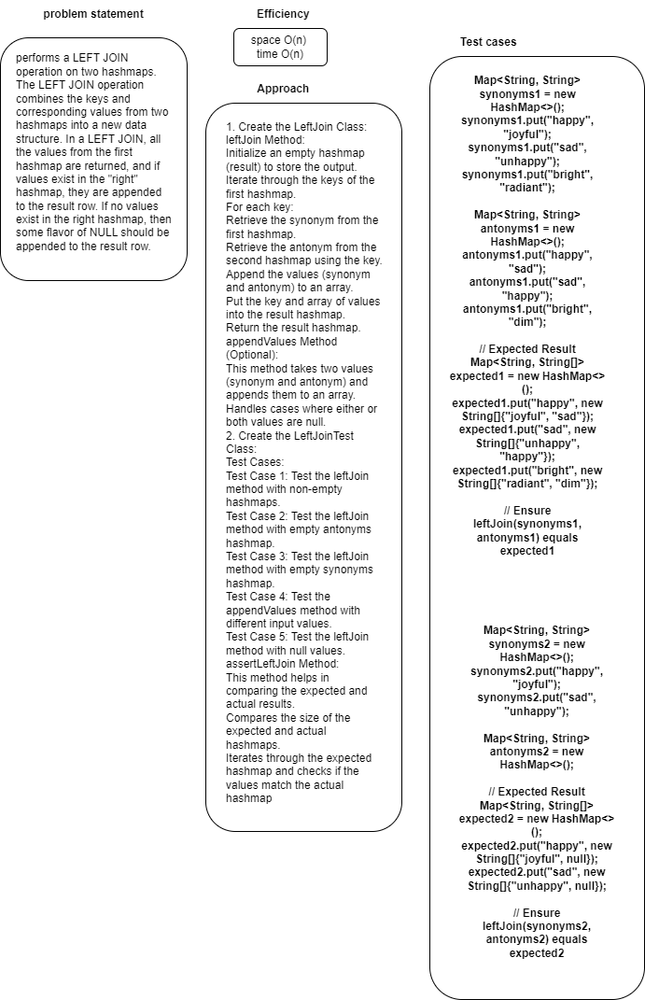

# left - join- hashmap
performs a LEFT JOIN operation on two hashmaps. The LEFT JOIN operation combines the keys and corresponding values from two hashmaps into a new data structure. In a LEFT JOIN, all the values from the first hashmap are returned, and if values exist in the "right" hashmap, they are appended to the result row. If no values exist in the right hashmap, then some flavor of NULL should be appended to the result row.
## Whiteboard Process

## Approach & Efficiency
1. Create the LeftJoin Class:
   leftJoin Method:
   Initialize an empty hashmap (result) to store the output.
   Iterate through the keys of the first hashmap.
   For each key:
   Retrieve the synonym from the first hashmap.
   Retrieve the antonym from the second hashmap using the key.
   Append the values (synonym and antonym) to an array.
   Put the key and array of values into the result hashmap.
   Return the result hashmap.
   appendValues Method (Optional):
   This method takes two values (synonym and antonym) and appends them to an array.
   Handles cases where either or both values are null.
2. Create the LeftJoinTest Class:
   Test Cases:
   Test Case 1: Test the leftJoin method with non-empty hashmaps.
   Test Case 2: Test the leftJoin method with empty antonyms hashmap.
   Test Case 3: Test the leftJoin method with empty synonyms hashmap.
   Test Case 4: Test the appendValues method with different input values.
   Test Case 5: Test the leftJoin method with null values.
   assertLeftJoin Method:
   This method helps in comparing the expected and actual results.
   Compares the size of the expected and actual hashmaps.
   Iterates through the expected hashmap and checks if the values match the actual hashmap. 

space O(n)
Time O(n)
## Solution

