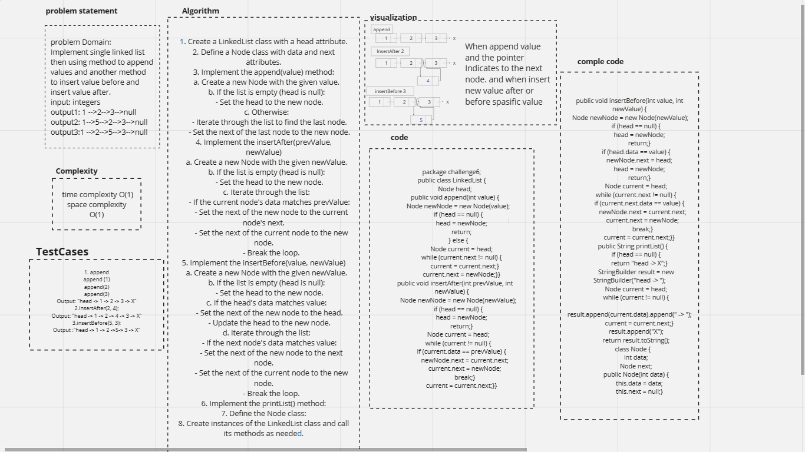

# data-structures-and-algorithms

# linked list insetion 

## Linked List Insertions

1. Initialization of Linked List
    - Create an empty linked list.

2. Methods Implementation:
    - **Append:** Implement a method that adds a new node containing the provided value to the end of the linked list.
    - **Insert Before:** Implement a method that adds a new node containing the provided value immediately before the first node with the specified value.
    - **Insert After:** Implement a method that adds a new node containing the provided value immediately after the first node with the specified value.

3. Test Cases:
    - **Test Append Single Node:** Create a test to verify the functionality of appending a single node to the linked list.
    - **Test Append Multiple Nodes:** Create a test to ensure that appending multiple nodes works correctly.
    - **Test Insert Before Middle:** Write a test case to confirm the correct insertion of a node before a middle node in the linked list.
    - **Test Insert Before First:** Develop a test to validate the insertion of a node before the first node in the linked list.
    - **Test Insert After Middle:** Create a test case to verify the insertion of a node after a middle node in the linked list.
    - **Test Insert After Last:** Write a test to ensure that a node can be inserted after the last node in the linked list.

## Whiteboard Process

## Approach & Efficiency

1. Problem Definition (Binary Search):
   Begin by clearly defining the problem at hand, which is binary search in this case.

2. Conceptual Visualization:
   Create a basic diagram that visually represents the concept of searching for a key using binary search. This can help in understanding the algorithm's underlying idea.

3. Code Implementation - Initial Part:
   Start by attempting to write the code for the initial steps of the binary search algorithm, such as initializing variables for low, high, and mid.

4. Complete Code in Java:
   Proceed to write the entire binary search algorithm using the Java programming language. This includes setting up the loop, calculating the midpoint, comparing values, and updating the search range.

5. Code Verification:
   Run the written code to verify its correctness. This step ensures that the algorithm produces the expected results and operates as intended.

6. Creation of Test Cases:
   Develop a set of test cases that cover various scenarios to rigorously test the binary search algorithm's functionality. This involves different cases such as finding keys within the array, keys that are not present, and edge cases.

7. Visual Representation on Whiteboard:
   Draw the relevant data structures on a whiteboard to illustrate the progress of the algorithm during different iterations. This visual aid helps in comprehending the algorithm's execution and tracking variables' values.

## it took three hours  and test cases then draw the whiteboard.

## Time Complexity  insertBefore, insertAfter , append (O( n)) / insert O(1)

## Space Complexity (O(n))

## Solution

this the output in the terminal :

