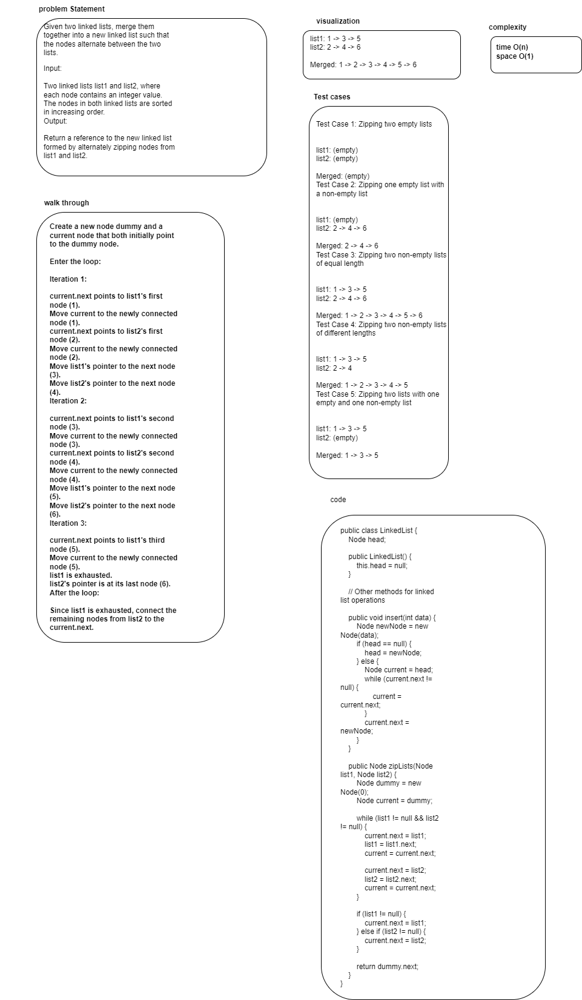

# Linked-list-zip
implementing a function that merges between two lists node and return one list that has both lists node.

## Whiteboard Process

## Approach & Efficiency

1. Create a zipLists function that takes two linked lists as input and returns the merged linked list.
2. Initialize a dummy node and a current node, both pointing to the same dummy node initially.
3. Use a loop to iterate through both input linked lists while they have elements.
4. Inside the loop:
- Connect the current.next to the first node of the first linked list.
- Move the current pointer to the newly connected node.
- Connect the current.next to the first node of the second linked list.
- Move the current pointer to the newly connected node.
- Move the pointers in both input linked lists to their next nodes.
5. After the loop, if there are any remaining nodes in either of the input linked lists, connect the current.next to those remaining nodes.
6. Return the merged linked list starting from dummy.next.

time complexity O(n)
space complexity O (1)

## Solution
