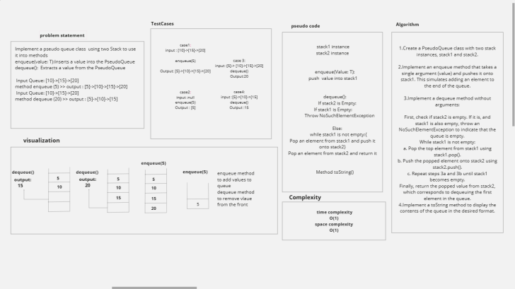
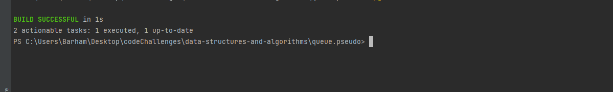

# PseudoQueue

build  queue data structure using two stack data structures.
The goal is to create a queue that supports two basic operations:enqueue and dequeue, following a first-in, first-out (FIFO) approach.

## Whiteboard Process

## Approach & Efficiency
1. Custom Stacks Implementation:
    - Create two custom stack data structures, one designated as the "input" stack and the other as the "output" stack.

2. Enqueue Operation (Adding to Queue):
    - Add a new element to the "input" stack. This operation is efficient with a time complexity of O(1).

3. Dequeue Operation (Removing from Queue):
    - If the "output" stack is not empty, remove and return an element from it. This ensures the queue's FIFO order and has a fast time complexity of O(1).
    - If the "output" stack is empty:
        - Transfer all elements from the "input" stack to the "output" stack. This reverses their order but guarantees that the oldest "input" element becomes the newest "output" element.
        - Once the "output" stack is populated, remove and return an element from it. In the worst case, this operation is O(n) as it involves moving all elements once, but on average, it remains an efficient amortized O(1) operation per dequeue.

4. Empty Queue Check:
    - Determine if both the "input" and "output" stacks are empty to ascertain whether the queue is empty or not.

Efficiency O(1)

# Solution 

