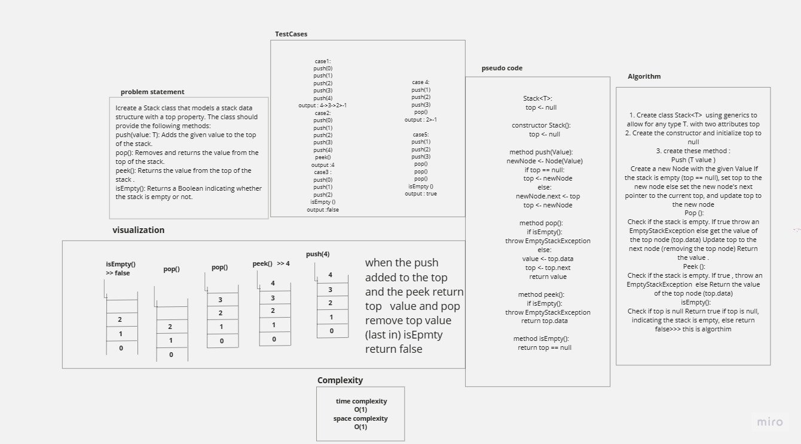
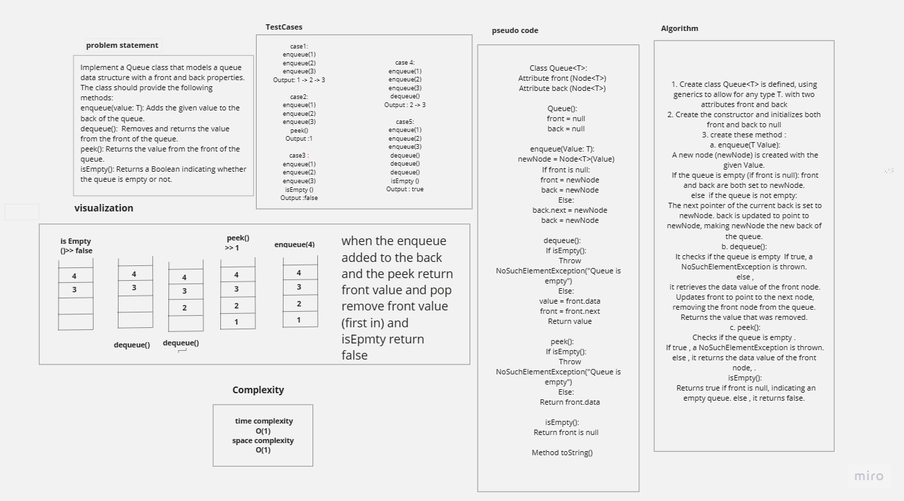
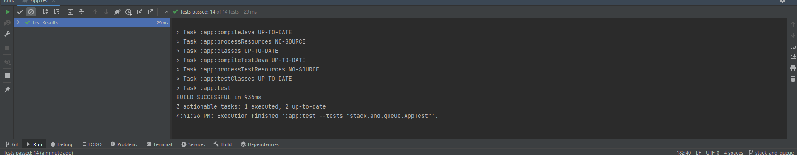
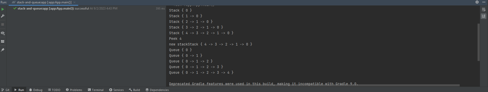
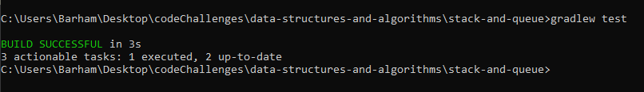

# stack-and-queue

is to create Stack and Queue and implement method for them such as push and pop for the stack 
and enqueue and denqueue for the Queue  

## Whiteboard Process

## Approach & Efficiency
1. The first thing specify the problem (implementation stack and queue classes and Node)
2. Draw simple diagram to understand the idea
3. Try to write the code for this part
4. Write the whole code using java language
5. Run the code to be sure is it correct
6. write test cases for code and then run it
7. Drawing the data structure in white board 
## Time Complexity (O(1)  
## Space Complexity (O(1))

## Solution

