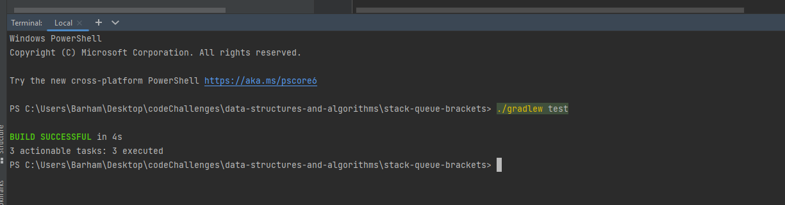

# stack-queue-brackets
Create a function to check if a provided string contains balanced brackets, including round '()', square '[]', and curly '{}' brackets. Balanced brackets mean that for every opening bracket, there is a matching closing bracket, and they are properly nested within the string. The goal is to determine if the brackets within the string are balanced or not. 

## Whiteboard Process

## Approach & Efficiency

(Approach)
Initialize a Stack: Create an empty stack to keep track of the opening brackets encountered in the string.

Iterate Through the String: Traverse the input string character by character.

For Each Character:

If the character is an opening bracket ('(', '[', or '{'), push it onto the stack.
If the character is a closing bracket (')', ']', or '}'):
Check if the stack is empty. If it is, return false because there's a closing bracket without a corresponding opening bracket.
Pop the top character from the stack and check if it matches the current closing bracket. If they don't match, return false because there's a mismatched bracket pair.
Final Check: After processing all characters, check if the stack is empty. If it is, return true, indicating that all brackets are balanced. If there are remaining unmatched opening brackets in the stack, return false.

(Efficiency)
Time complexity O(N)
space complexity O(N)

## Solution

