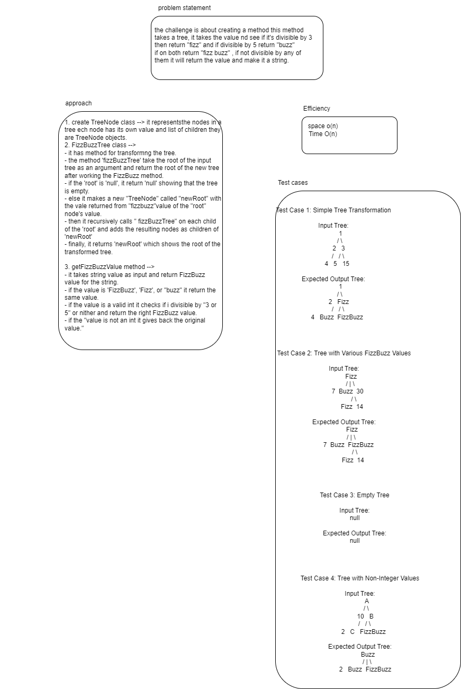

# Fizz buzz tree 
the challenge is about creating a method this method takes a tree, it takes the vslue nd see if it's divisible by 3 then return "fizz" and if divisible by 5 return "buzz"
if on both return "fizz buzz" , if not divisible by any of them it will return the value and make it a string.
## Whiteboard Process

## Approach & Efficiency

- time complexity O(N)
- space complexity O(N)

1. create TreeNode class --> it representsthe nodes in a tree ech node has its own value and list of children they are TreeNode objects.
2. FizzBuzzTree class --> 
- it has method for transformng the tree.
- the method 'fizzBuzzTree' take the root of the input tree as an argument and return the root of the new tree after working the FizzBuzz method.
- if the 'root' is 'null', it return 'null' showing that the tree is empty.
- else it makes a new "TreeNode" called "newRoot" with the vale returned from "fizzbuzz"value of the "root" node's value.
- then it recursively calls " fizzBuzzTree" on each child of the 'root' and adds the resulting nodes as children of 'newRoot'
- finally, it returns 'newRoot' which shows the root of the transformed tree.

3. getFizzBuzzValue method --> 
- it takes string value as input and return FizzBuzz  value for the string.
- if the value is 'FizzBuzz', 'Fizz', or "buzz" it return the same value.
- if the value is a valid int it checks if i divisible by "3 or 5" or nither and return the right FizzBuzz value.
- if the "value is not an int it gives back the original value."

## Solution

