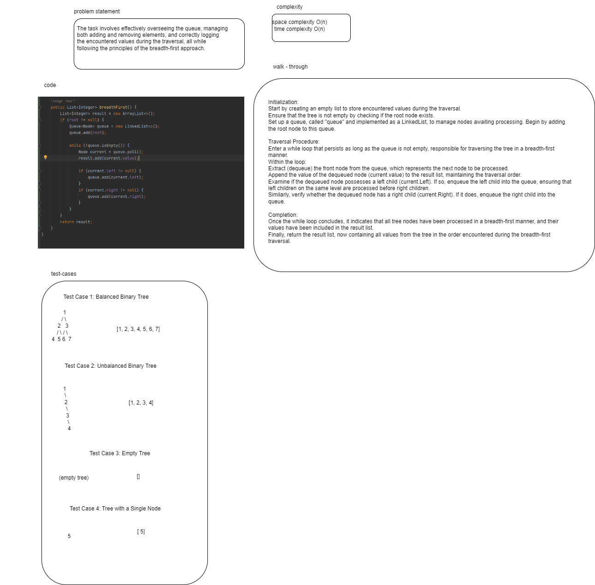

# Breadth-first Traversal. 
The task involves effectively overseeing the queue, managing both adding and removing elements, and correctly logging the encountered values during the traversal, all while following the principles of the breadth-first approach.

# whiteboard

# effiiency and approach 
**time complexity**   O(n)
**space complexity** O(n)

Initialization:
Start by creating an empty list to store encountered values during the traversal.
Ensure that the tree is not empty by checking if the root node exists.
Set up a queue, called "queue" and implemented as a LinkedList, to manage nodes awaiting processing. Begin by adding the root node to this queue.

Traversal Procedure:
Enter a while loop that persists as long as the queue is not empty, responsible for traversing the tree in a breadth-first manner.
Within the loop:
Extract (dequeue) the front node from the queue, which represents the next node to be processed.
Append the value of the dequeued node (current.value) to the result list, maintaining the traversal order.
Examine if the dequeued node possesses a left child (current.Left). If so, enqueue the left child into the queue, ensuring that left children on the same level are processed before right children.
Similarly, verify whether the dequeued node has a right child (current.Right). If it does, enqueue the right child into the queue.

Completion:
Once the while loop concludes, it indicates that all tree nodes have been processed in a breadth-first manner, and their values have been included in the result list.
Finally, return the result list, now containing all values from the tree in the order encountered during the breadth-first traversal.

# solution 

