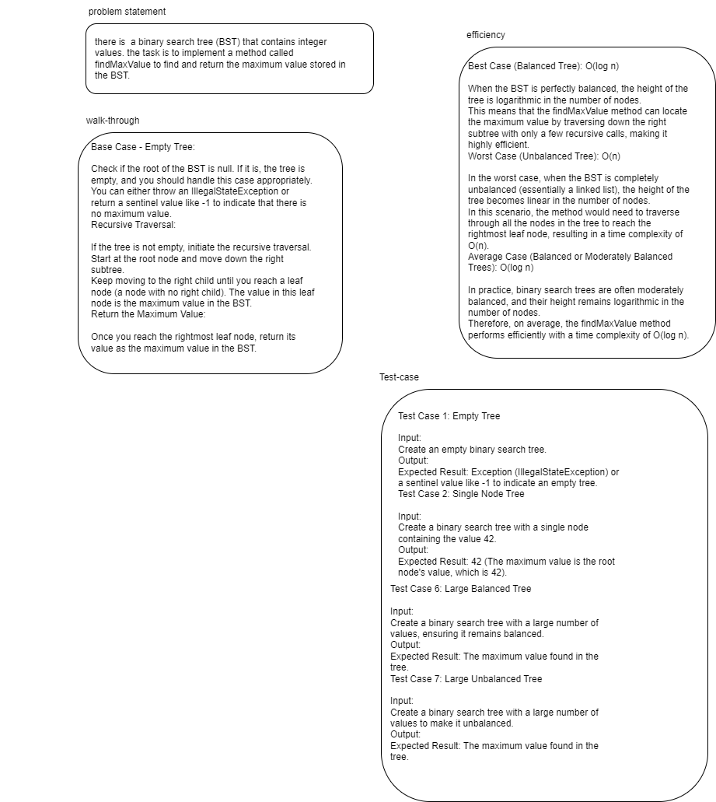
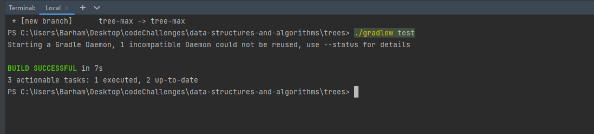

## find max of tree

s designed to find and return the maximum (largest) value stored within the binary search tree (BST). Here's a description of the method and its functions:

Method Name: findMaxValue

Functionality:

The primary function of this method is to identify and return the maximum value stored in the binary search tree.
It accomplishes this task by recursively traversing the right subtrees of the BST, as in a valid BST structure, the largest value is always found in the rightmost node.
If the tree is empty, the method throws an IllegalStateException or returns a special value (based on implementation) to indicate that there is no maximum value.

## Whiteboard 

## Approach
Base Case - Empty Tree:

Check if the root of the BST is null. If it is, the tree is empty, and you should handle this case appropriately. You can either throw an IllegalStateException or return a sentinel value like -1 to indicate that there is no maximum value.
Recursive Traversal:

If the tree is not empty, initiate the recursive traversal.
Start at the root node and move down the right subtree.
Keep moving to the right child until you reach a leaf node (a node with no right child). The value in this leaf node is the maximum value in the BST.
Return the Maximum Value:

Once you reach the rightmost leaf node, return its value as the maximum value in the BST.

## Efficiency 
Best Case (Balanced Tree): O(log n)

When the BST is perfectly balanced, the height of the tree is logarithmic in the number of nodes.
This means that the findMaxValue method can locate the maximum value by traversing down the right subtree with only a few recursive calls, making it highly efficient.
Worst Case (Unbalanced Tree): O(n)

In the worst case, when the BST is completely unbalanced (essentially a linked list), the height of the tree becomes linear in the number of nodes.
In this scenario, the method would need to traverse through all the nodes in the tree to reach the rightmost leaf node, resulting in a time complexity of O(n).
Average Case (Balanced or Moderately Balanced Trees): O(log n)

In practice, binary search trees are often moderately balanced, and their height remains logarithmic in the number of nodes.
Therefore, on average, the findMaxValue method performs efficiently with a time complexity of O(log n).

## solution 

