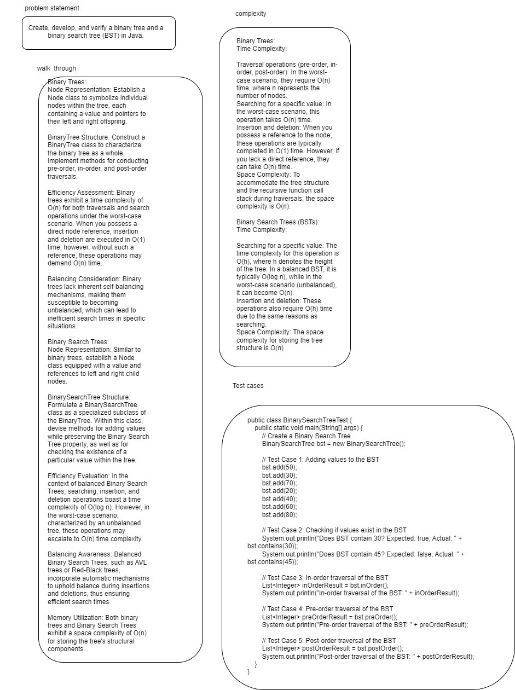
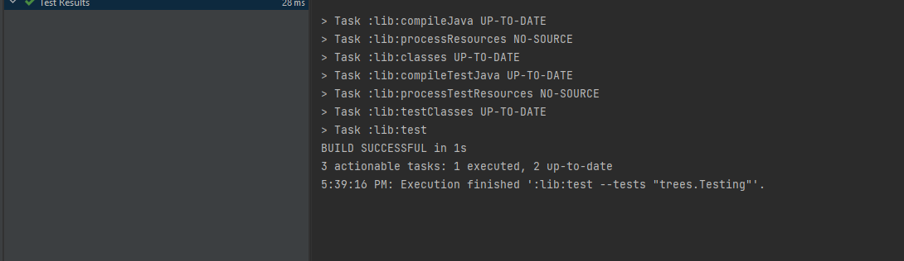

## Trees 

Create, develop, and verify a binary tree and a binary search tree (BST) in Java.

## Whiteboard 

## Efficiency 
Binary Trees:
Time Complexity:

Traversal operations (pre-order, in-order, post-order): In the worst-case scenario, they require O(n) time, where n represents the number of nodes.
Searching for a specific value: In the worst-case scenario, this operation takes O(n) time.
Insertion and deletion: When you possess a reference to the node, these operations are typically completed in O(1) time. However, if you lack a direct reference, they can take O(n) time.
Space Complexity: To accommodate the tree structure and the recursive function call stack during traversals, the space complexity is O(n).

Binary Search Trees (BSTs):
Time Complexity:

Searching for a specific value: The time complexity for this operation is O(h), where h denotes the height of the tree. In a balanced BST, it is typically O(log n), while in the worst-case scenario (unbalanced), it can become O(n).
Insertion and deletion: These operations also require O(h) time due to the same reasons as searching.
Space Complexity: The space complexity for storing the tree structure is O(n).

## Approach 
Binary Trees:
Node Representation: Establish a Node class to symbolize individual nodes within the tree, each containing a value and pointers to their left and right offspring.

BinaryTree Structure: Construct a BinaryTree class to characterize the binary tree as a whole. Implement methods for conducting pre-order, in-order, and post-order traversals.

Efficiency Assessment: Binary trees exhibit a time complexity of O(n) for both traversals and search operations under the worst-case scenario. When you possess a direct node reference, insertion and deletion are executed in O(1) time; however, without such a reference, these operations may demand O(n) time.

Balancing Consideration: Binary trees lack inherent self-balancing mechanisms, making them susceptible to becoming unbalanced, which can lead to inefficient search times in specific situations.

Binary Search Trees:
Node Representation: Similar to binary trees, establish a Node class equipped with a value and references to left and right child nodes.

BinarySearchTree Structure: Formulate a BinarySearchTree class as a specialized subclass of the BinaryTree. Within this class, devise methods for adding values while preserving the Binary Search Tree property, as well as for checking the existence of a particular value within the tree.

Efficiency Evaluation: In the context of balanced Binary Search Trees, searching, insertion, and deletion operations boast a time complexity of O(log n). However, in the worst-case scenario, characterized by an unbalanced tree, these operations may escalate to O(n) time complexity.

Balancing Awareness: Balanced Binary Search Trees, such as AVL trees or Red-Black trees, incorporate automatic mechanisms to uphold balance during insertions and deletions, thus ensuring efficient search times.

Memory Utilization: Both binary trees and Binary Search Trees exhibit a space complexity of O(n) for storing the tree's structural components.

## solution 

